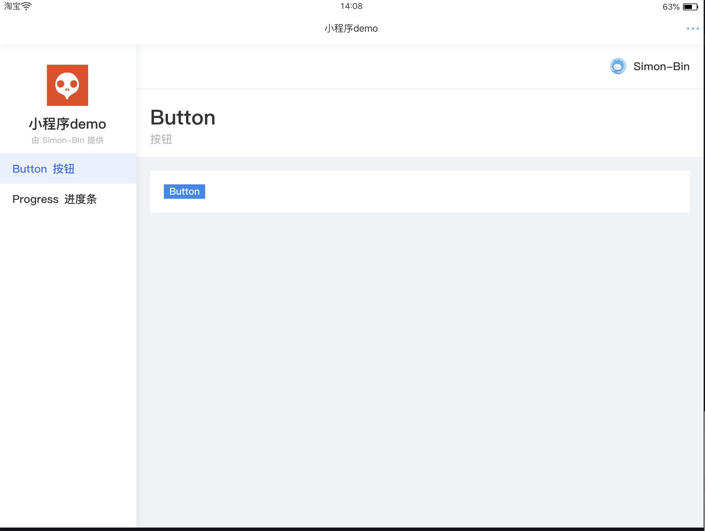

# taobao-mini-demo

淘宝小程序 练习 demo

### 预览



### 目录结构

```
.
├── README.md									
├── client				
│   ├── app.acss								// 全局样式
│   ├── app.js									// 小程序入口，包含:request、auth等全局方法
│   ├── app.json								// 全局配置
│   ├── assets									// 静态资源
│   │   ├── avator.png
│   │   └── logo.png
│   ├── blocks									// 页面区块
│   │   ├── button
│   │   └── progress
│   ├── components							// 全局组件
│   │   ├── content							// 内容布局
│   │   ├── header							// 顶部布局
│   │   ├── layout							// 容器布局
│   │   ├── loading							// 加载组件
│   │   ├── menu								// 菜单组件
│   │   ├── page-header					// 页头组件
│   │   └── sider								// 侧边栏布局
│   ├── package-lock.json
│   ├── package.json
│   ├── pages										// 页面文件夹  
│   │   ├── auth								// 授权页面
│   │   ├── index								// 页面结构示例
│   │   └── layout							// 主页
│   └── snapshot.png
├── mini.project.json
├── screenshot.png
└── server
    └── helloworld							// 云函数
        ├── cloud.json
        ├── index.js
        └── package.json
```


### TODO

- [x] menu、sider等基本布局

- [x] 授权页面、auth工具

- [x] 云函数调用、request工具

  …...

### 组件

- [x] loading

- [x] 布局组件

  - layout 
  - sider
  - header
  - content

- [x] menu

- [x] page-header

- [ ] table

  …...